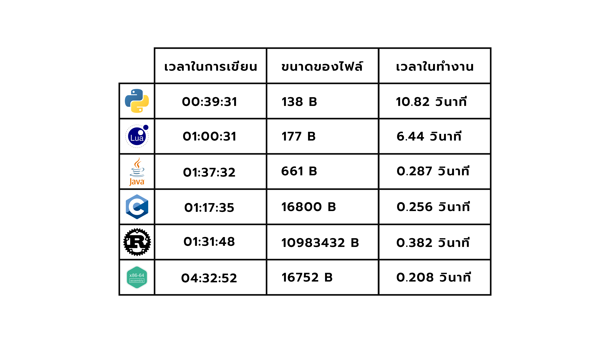

## About Programming Language Comparision

_BeyondTicTacToeAI_ - a project for training an AI to play TicTacToe Game, but not traditional game, it's Beyond Tic Tac Toe Game by using reinforcement learning (Q-learning).

In this project, I made Traditional Tic Tac Toe game which can be controlled by click on game gui. Also I create Beyond Tic Tac Toe game that we can select the size to place the mark. And another important part is the use of reinforcement learning to create AI to play this game.

## Youtube

For more information can be seen in my [video]("https://youtu.be/METnSa6vqD8") on YouTube.

[]("https://youtu.be/METnSa6vqD8")

## Requirements

- Linux OS
- Python3 interpreter
- LUA interpreter
- JRE
- GCC

## Testing

- Python
  - For testing the result
    ```bash
    python3 ./Python/prime_python.py
    ```
  - For testing the size
    ```bash
    wc -c ./Python/prime_python.py
    ```
  - For testing the speed
    ```bash
    time echo "99999989" | python3 ./Python/prime_python.py
    ```
- LUA
  - For testing the result
    ```bash
    lua ./LUA/prime_lua.lua
    ```
  - For testing the size
    ```bash
    wc -c ./LUA/prime_lua.lua
    ```
  - For testing the speed
    ```bash
    time echo "99999989" | lua ./LUA/prime_lua.lua
    ```
- Java
  - Compile Java Class
    ```bash
    javac ./Java/prime_java.java
    ```
  - For testing the result
    ```bash
    java ./Java/Main.class
    ```
  - For testing the size
    ```bash
    wc -c ./Java/Main.class
    ```
  - For testing the speed
    ```bash
    time echo "99999989" | java ./Java/Main.class
    ```
- C Language
  - Compile C file
    ```bash
    gcc ./C/prime_c.c -o ./C/prime_c
    ```
  - For testing the result
    ```bash
    ./C/prime_c
    ```
  - For testing the size
    ```bash
    wc -c ./C/prime_c
    ```
  - For testing the speed
    ```bash
    time echo "99999989" | ./C/prime_c
    ```
- Rust
  - Compile Rust file
    ```bash
    rustc ./Rust/prime_rust.rs
    ```
  - For testing the result
    ```bash
    ./Rust/prime_rust
    ```
  - For testing the size
    ```bash
    wc -c ./Rust/prime_rust
    ```
  - For testing the speed
    ```bash
    time echo "99999989" | ./Rust/prime_rust
    ```
- Assembly
  - Compile Assembly file
    ```bash
    gcc ./Assembly/prime_asm.s -o ./Assembly/prime_asm
    ```
  - For testing the result
    ```bash
    ./Assembly/prime_asm
    ```
  - For testing the size
    ```bash
    wc -c ./Assembly/prime_asm
    ```
  - For testing the speed
    ```bash
    time echo "99999989" | ./Assembly/prime_asm
    ```

## Result


